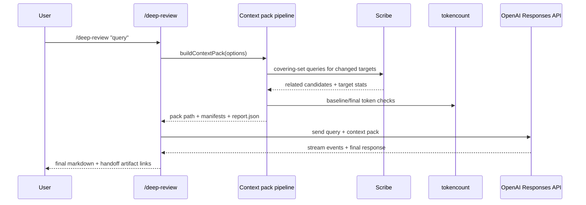

# Deep Review Architecture

Maintainer-facing architecture and behavior notes for `/deep-review`.

This is the single source of truth for deep-review internals.

- User-facing usage/docs: `extensions/deep-review/README.md`
- Backlog and next work: `extensions/deep-review/TODO.md`

---

## Goals

1. Deterministic context packing
2. Explicit omission reasons (auditable)
3. Reliable end-to-end deep review flow
4. Practical runtime on large repos

---

## High-level flow



---

## Context-pack pipeline

```mermaid
flowchart TD
    A[Resolve repo + base ref] --> B[Collect changed files + diff]
    B --> C[Filter/validate changed files]
    C --> D[Run Scribe recall for eligible changed targets]
    D --> E[Merge + dedupe related candidates]
    E --> F[Apply related filters]
    F --> G[Rank candidates deterministically]
    G --> H[Estimate candidate tokens]
    H --> I[Render baseline pack (changed only)]
    I --> J[Token count baseline]
    J --> K{baseline > budget?}
    K -- yes --> L[core-over-budget failure report]
    K -- no --> M[Budget-fit related candidates]
    M --> N[Render final pack]
    N --> O[Token count final]
    O --> P{final > budget?}
    P -- yes --> Q[Tail-trim lowest-ranked related, retry]
    Q --> N
    P -- no --> R[Write manifests + report.json]
```

---

## Deterministic selection rules

### Ranking tuple

Related candidates are sorted by:

1. `relationWeight` (desc)
2. `frequency` (desc)
3. `distance` (asc)
4. `estimatedTokens` (asc)
5. `path` (asc)

### Invariants

- Changed files are highest priority and included unless explicitly filtered.
- Related files are included/omitted deterministically under budget pressure.
- Omissions are explicit (filter reason or `over-budget`).
- If core (changed-only baseline) exceeds budget, fail with `core-over-budget`.

---

## Artifacts

- `pr-context.txt`
- `pr-context.changed.files.txt`
- `pr-context.related.files.txt`
- `pr-context.omitted.files.txt`
- `pr-context.related.omitted.files.txt`
- `pr-context.related.selection.tsv`
- `pr-context.scribe.targets.tsv`
- `pr-context.report.json`

---

## Omission reason model (current)

- `filtered:lockfile`
- `filtered:env`
- `filtered:secret`
- `filtered:binary`
- `filtered:docs`
- `filtered:tests`
- `filtered:tests-not-close`
- `filtered:generated-cache`
- `filtered:missing`
- `filtered:unknown`
- `over-budget`
- `scribe-target-failed`
- `scribe-limits-reached`

Note: related overlap with changed files is de-duplicated and not counted as related omission noise.

---

## Key implementation decisions

1. **Direct in-extension pipeline**
   - Removed nested `pi -p --skill` context-pack execution.
   - Uses typed return data and report files instead of stdout parsing.

2. **Modern Scribe only**
   - Invoked via `npx @sibyllinesoft/scribe@1.0.4`.
   - Avoids Cargo `scribe-cli` flag incompatibility.

3. **Compact warning surfacing**
   - Prevents giant warning dumps in the UI summary.

4. **Request headroom reserve in deep-review**
   - Context-pack budget is reduced to leave room for query + protocol overhead.

---

## Performance profile / known bottlenecks

Likely hotspots on large repos:

1. Scribe fan-out across many changed targets
2. Per-candidate token estimation subprocess overhead
3. Repeated render/recount loops near budget boundary

This is the highest-priority improvement area.

---

## Experiment log

### Broad forced local test inclusion from diff-affected directories

Intent:

- Prevent local high-value tests from being dropped by budget cuts.

Observed outcome:

- Helped in specific repos/cases.
- Also displaced runtime/helper files in some runs.
- Increased complexity and runtime.
- Risk of overfitting to one repo structure.

Current stance:

- Treat as inconclusive/partial experiment, not universal default policy.
- Prefer generic defaults + optional repo-level overrides.

---

## Future direction (summary)

1. Speed-first optimization (batch token estimation, timing telemetry, targeted concurrency)
2. Generic default policy (avoid overfitting to one repo shape)
3. Optional repo-level policy overrides (for project-specific priorities)
4. Optional UX fallback for budget arbitration (interactive omission control)

See `TODO.md` for active items.
