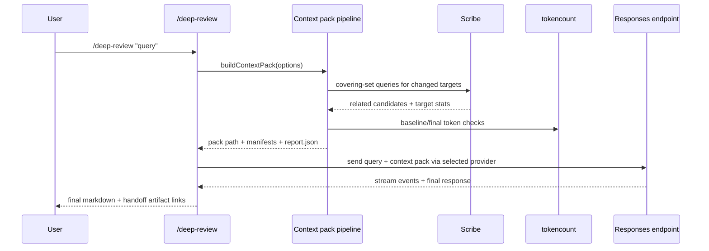
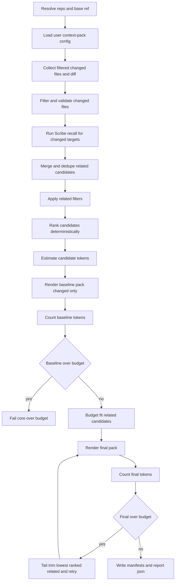

# Deep Review Architecture

Maintainer-facing architecture and behavior notes for `/deep-review`.

This is the single source of truth for deep-review internals.

- User-facing usage/docs: `extensions/deep-review/README.md`
- Backlog and next work: `extensions/deep-review/TODO.md`

---

## Goals

1. Deterministic context packing
2. Explicit omission reasons (auditable)
3. Reliable end-to-end deep review flow
4. Practical runtime on large repos

---

## High-level flow

```mermaid
sequenceDiagram
    participant U as User
    participant DR as /deep-review
    participant CP as Context pack pipeline
    participant S as Scribe
    participant T as tokencount
    participant O as Responses endpoint

    U->>DR: /deep-review "query"
    DR->>CP: buildContextPack(options)
    CP->>S: covering-set queries for changed targets
    S-->>CP: related candidates + target stats
    CP->>T: baseline/final token checks
    CP-->>DR: pack path + manifests + report.json
    DR->>O: send query + context pack via selected provider
    O-->>DR: stream events + final response
    DR-->>U: final markdown + handoff artifact links
```

---

## Response routing

- Default route: `openai-codex/gpt-5.6-sol` with `max` reasoning via `https://chatgpt.com/backend-api/codex/responses`. It keeps the Codex backend's registered 372K context window.
- Platform route: pass `--provider openai` to use `openai/gpt-5.6-sol` with `reasoning.mode: "pro"`, `max` effort, the official 1.05M context window, and `OPENAI_API_KEY` / OpenAI Platform auth.
- Request metadata records provider, endpoint, and auth source in debug events, final report, and handoff metadata.

---

## Context-pack pipeline

```mermaid
flowchart TD
    A[Resolve repo and base ref] --> B[Load user context-pack config]
    B --> C[Collect filtered changed files and diff]
    C --> D[Filter and validate changed files]
    D --> E[Run Scribe recall for changed targets]
    E --> F[Merge and dedupe related candidates]
    F --> G[Apply related filters]
    G --> H[Rank candidates deterministically]
    H --> I[Estimate candidate tokens]
    I --> J[Render baseline pack changed only]
    J --> K[Count baseline tokens]
    K --> L{Baseline over budget}
    L -- yes --> M[Fail core over budget]
    L -- no --> N[Budget fit related candidates]
    N --> O[Render final pack]
    O --> P[Count final tokens]
    P --> Q{Final over budget}
    Q -- yes --> R[Tail trim lowest ranked related and retry]
    R --> O
    Q -- no --> S[Write manifests and report json]
```

---

## Recall strategy and budget philosophy

### Default policy: recall first, cut later

Context packing intentionally separates **recall** from **selection**:

1. Recall broadly with Scribe (default unbounded traversal behavior)
2. Build the full candidate universe visible to the packer
3. Apply deterministic ranking and budget fit in the packer
4. Omit only for explicit filter reasons or explicit budget pressure

This keeps omission reasons auditable and avoids hidden upstream drops whenever possible.

### Why this is different from bounded-Scribe-first

Running Scribe with strict bounds first (for example shallow `--max-depth` / file caps) is **not equivalent** to rank-then-trim:

- Bounded recall can hide high-value candidates before ranking sees them.
- Rank-then-trim starts from a larger visible set and drops only at the selection boundary.
- Tradeoff: bounded recall is usually faster; recall-first is usually safer for review completeness.

### Future fallback shape (optional, not default)

A future adaptive mode can still be useful for very large repos:

- keep recall-first as default quality mode
- add optional multi-pass/bounded recall profiles as a speed fallback
- record the profile and bounds used in report metadata so behavior stays explainable

## Deterministic selection rules

### Ranking tuple

Related candidates are sorted by:

1. `relationWeight` (desc)
2. `frequency` (desc)
3. `distance` (asc)
4. `estimatedTokens` (asc)
5. `path` (asc)

### Invariants

- Changed files are highest priority and included unless explicitly filtered.
- User config excludes are applied before diff rendering, full-file rendering, Scribe target selection, and related candidate selection.
- Related files are included/omitted deterministically under budget pressure.
- Omissions are explicit (filter reason or `over-budget`).
- If core (changed-only baseline) exceeds budget, fail with `core-over-budget`.

---

## Artifacts

- `pr-context.txt`
- `pr-context.changed.files.txt`
- `pr-context.related.files.txt`
- `pr-context.omitted.files.txt`
- `pr-context.related.omitted.files.txt`
- `pr-context.related.selection.tsv`
- `pr-context.scribe.targets.tsv`
- `pr-context.report.json`

---

## Omission reason model (current)

- `filtered:lockfile`
- `filtered:env`
- `filtered:secret`
- `filtered:binary`
- `filtered:docs`
- `filtered:tests`
- `filtered:tests-not-close`
- `filtered:generated-cache`
- `filtered:config-exclude`
- `filtered:missing`
- `filtered:unknown`
- `over-budget`
- `scribe-target-failed`
- `scribe-limits-reached`

Note: related overlap with changed files is de-duplicated and not counted as related omission noise.

---

## Key implementation decisions

1. **Direct in-extension pipeline**
   - Removed nested `pi -p --skill` context-pack execution.
   - Uses typed return data and report files instead of stdout parsing.

2. **Modern Scribe only**
   - Invoked via `npx @sibyllinesoft/scribe@1.0.4`.
   - Avoids Cargo `scribe-cli` flag incompatibility.

3. **Compact warning surfacing**
   - Prevents giant warning dumps in the UI summary.

4. **Request headroom reserve in deep-review**
   - Context-pack budget is reduced to leave room for query + protocol overhead.

5. **Manual budget model cap**
   - Manual `--budget` overrides are capped by the selected model's hard input limit when model metadata is available.
   - This prevents expensive context-pack generation from producing a request the provider rejects for context length.

6. **Provider-specific GPT-5.6 context**

   - Codex subscription GPT-5.6 keeps Pi's registered 372K context window.
   - Direct OpenAI GPT-5.6 explicitly opts into the official 1.05M context window and long-context pricing tier.
   - Direct OpenAI GPT-5.6 defaults to pro reasoning mode; the Codex route does not send `reasoning.mode`.

7. **Recall-first selection policy**
   - Prefer broad recall and explicit budget trimming over early bounded graph pruning.
   - Prioritizes review completeness and omission transparency over raw speed.

8. **User config excludes**
   - Reads optional user config from `~/.pi/deep-review.json`.
   - Supports exact repo-root entries under `contextPack.repos` with repo-root-relative `exclude` globs.
   - Excluded changed files are removed from git diff/full-file rendering and recorded as `filtered:config-exclude`.

---

## Performance profile / known bottlenecks

Likely hotspots on large repos:

1. Scribe fan-out across many changed targets
2. Per-candidate token estimation subprocess overhead
3. Repeated render/recount loops near budget boundary

This is the highest-priority improvement area.

---

## Experiment log

### Broad forced local test inclusion from diff-affected directories

Intent:

- Prevent local high-value tests from being dropped by budget cuts.

Observed outcome:

- Helped in specific repos/cases.
- Also displaced runtime/helper files in some runs.
- Increased complexity and runtime.
- Risk of overfitting to one repo structure.

Current stance:

- Treat as inconclusive/partial experiment, not universal default policy.
- Prefer generic defaults + optional repo-level overrides.

---

## Future direction (summary)

1. Speed-first optimization (batch token estimation, timing telemetry, targeted concurrency)
2. Keep recall-first quality defaults; add optional adaptive bounded-recall fallback profiles for large repos
3. Generic default policy (avoid overfitting to one repo shape)
4. Optional repo-level policy overrides (for project-specific priorities)
5. Optional UX fallback for budget arbitration (interactive omission control)

See `TODO.md` for active items.
