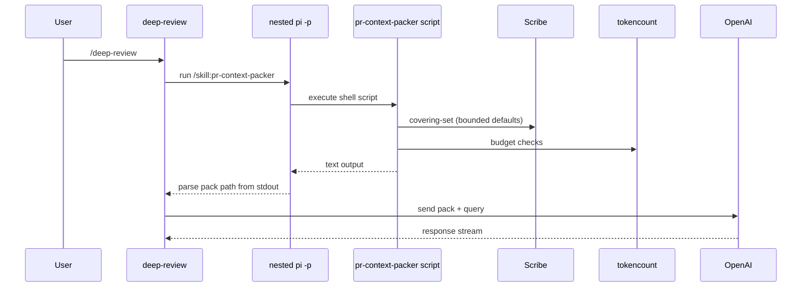
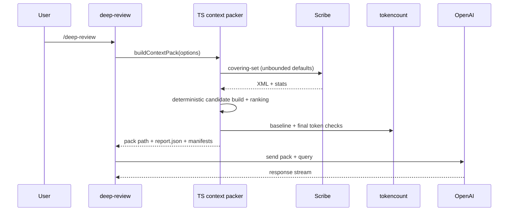
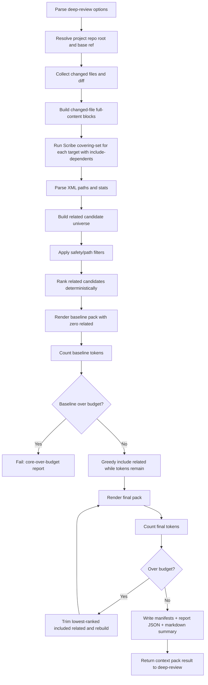
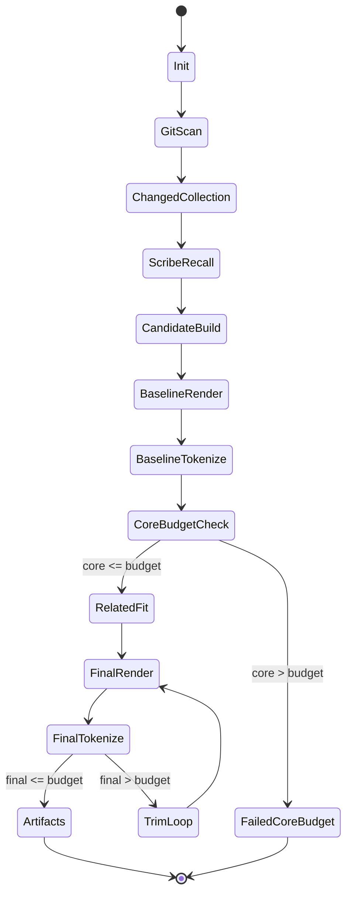

# Deep Review: Context Pack Rewrite Plan

Status: historical implementation plan (rewrite completed)
Owner: deep-review extension
Scope: replace nested `pi -p` + skill/script invocation with deterministic TypeScript implementation colocated in `extensions/deep-review/`

Active maintainer documentation now lives in:

- `extensions/deep-review/CONTEXT_PACK_INTERNALS.md`

---

## Why this rewrite

Today `/deep-review` shells out to a nested Pi session that runs `pr-context-packer` skill/script. That creates extra moving parts, parsing fragility, and less deterministic control over context-packing policy.

This plan replaces that path with a direct context-pack pipeline inside `deep-review`, while preserving (and improving) context quality guarantees.

---

## Goals

1. **Single execution surface**: `/deep-review` performs context packing directly (no nested `pi -p` sub-session).
2. **Deterministic behavior**: same input repo/branch/options => same selected files/order/output.
3. **No silent omission from recall stage**: avoid hidden loss from hard traversal caps by default.
4. **Budget-aware trimming only**: file omission should be explainable as either:
   - explicit safety filter, or
   - budget pressure.
5. **Strong observability**: machine-readable manifests + report JSON + markdown summary.

---

## Non-goals (for this phase)

- Interactive manual picker for omitted files (future phase).
- Semantic relevance model/reranker (future phase).
- External skill compatibility layer for old `pr-context-packer` CLI behavior.

---

## Core invariants

1. Changed files are highest priority and are always included unless blocked by explicit safety filters.
2. Related/dependent files are selected deterministically and trimmed from lowest rank only when needed.
3. Every omitted file from candidate set must have an explicit reason.
4. If core payload alone exceeds budget, fail explicitly with diagnostics.

---

## Current vs target (high-level)





---

## Exact target flow



---

## Clarifying “Scribe limits reached”

`limits_reached=true` in Scribe stats indicates the traversal stopped due configured/internal bounds.

In this plan, **default execution does not intentionally pass restrictive traversal caps** (`max-depth`, `max-files`, target-limit), so this should normally remain `false`.

Policy in this phase:

- If Scribe command fails for a target: mark target failed; continue collecting from others.
- If Scribe reports `limits_reached=true`: record in target report.
- Do **not** silently hide this; surface it in summary/report.

(Strict fail/warn policy can be toggled in future. This phase prioritizes deterministic transparency.)

---

## Candidate model and ordering

Related candidate scoring key (deterministic tuple):

1. `relationWeight` (higher first)
   - TargetFile/DirectDependency/DirectDependent > transitive
2. `frequency` across targets (higher first)
3. `distance` from target (lower first)
4. `estimatedTokens` (lower first)
5. `path` lexicographic (ascending)

This ensures stable ordering and predictable trimming.

---

## Omission reasons (normalized)

- `filtered:lockfile`
- `filtered:env`
- `filtered:secret`
- `filtered:binary`
- `filtered:docs`
- `filtered:tests`
- `filtered:tests-not-close`
- `over-budget`
- `scribe-target-failed`
- `scribe-limits-reached` (informational signal; candidate-level omission may still be unknown)

---

## Output artifacts

For `<out>/pr-context.txt`, also write:

- `pr-context.changed.files.txt`
- `pr-context.related.files.txt`
- `pr-context.omitted.files.txt`
- `pr-context.related.omitted.files.txt`
- `pr-context.related.selection.tsv`
- `pr-context.scribe.targets.tsv`
- `pr-context.report.json` (new, machine-readable contract)

### `report.json` shape (proposed)

```json
{
    "version": 1,
    "projectDir": "...",
    "repoRoot": "...",
    "baseRef": "origin/main",
    "baseCommit": "...",
    "headCommit": "...",
    "budget": 272000,
    "tokens": {
        "baseline": 123456,
        "final": 189000,
        "remaining": 83000,
        "encoding": "o200k-base"
    },
    "counts": {
        "changed": 12,
        "relatedCandidates": 240,
        "relatedIncluded": 57,
        "relatedOmitted": 183,
        "scribeTargets": 9,
        "scribeFailedTargets": 0,
        "scribeLimitSignals": 0
    },
    "paths": {
        "pack": ".../pr-context.txt",
        "changedManifest": "...",
        "relatedManifest": "...",
        "omittedManifest": "...",
        "relatedOmittedManifest": "...",
        "relatedSelectionManifest": "...",
        "scribeTargetsManifest": "..."
    },
    "status": "ok"
}
```

---

## Extension architecture (TS modules)

Proposed files under `extensions/deep-review/context-pack/`:

- `types.ts` — shared types/interfaces
- `git.ts` — base resolution, diff + changed files
- `filters.ts` — safety filters + omit reasons
- `scribe.ts` — Scribe invocation + XML parsing + stats extraction
- `rank.ts` — deterministic ranking and sorting
- `budget.ts` — token counting and greedy fit + trim loop
- `render.ts` — markdown pack rendering
- `artifacts.ts` — write manifests + report JSON
- `index.ts` — orchestration entry (`buildContextPack`)

`extensions/deep-review/index.ts` then imports this pipeline directly.

---

## Deep-review command behavior changes

### Before

- Launch nested `pi -p` with skill file.
- Parse context pack path out of terminal output.

### After

- Directly call `buildContextPack({...})`.
- Receive typed result object with exact paths + metrics.
- Post context-pack stage message from structured data (no fragile text parsing).

---

## Detailed execution stages



---

## Determinism rules

- Sort changed files lexicographically before processing.
- Stable target processing order.
- Stable candidate ordering with deterministic tie-breakers.
- Token estimation method fixed (`tokencount` with `o200k-base`).
- No randomization/time-based heuristics in selection logic.

---

## Error handling policy

1. **Not a git repo / no changed files** -> explicit hard error.
2. **Core over budget** -> explicit hard error (`core-over-budget`).
3. **Scribe target failure** -> continue with partial recall but report target failure count and list.
4. **Token counter parse failure** -> explicit hard error.

(Strict fail on any Scribe failure is a configurable future hardening pass.)

---

## Implementation sequence (hard cutover)

1. Add TS context-pack modules and tests.
2. Wire deep-review to call TS packer directly.
3. Remove nested `pi -p --skill` context-pack path in the same change.
4. Validate behavior on representative repos and edge cases.
5. Update README/help text and extension TODO.

---

## Test plan

### Unit tests

- Option parsing and base ref resolution.
- Filter reason classification.
- Rank ordering determinism.
- Greedy fit + trim loop behavior.
- Report JSON schema snapshots.

### Integration tests

- Small repo: includes changed + related successfully.
- No Scribe installed: graceful degraded path (changed-only + warning).
- Large repo over budget: deterministic trimming and omission reporting.
- Core over budget: explicit failure path.

---

## Future follow-ups (out of scope for now)

- Interactive omitted-file picker in deep-review UI.
- Semantic reranking (`query`-aware) as optional stage.
- Automatic multi-pass bounded fallback profiles when recall cost/runtime is excessive.
- Context-pack cache/reuse keyed by repo + branch + base/head commit fingerprint, with explicit override path support.

---

## Summary

This rewrite makes context packing local, typed, and deterministic in `deep-review`, eliminates fragile nested Pi orchestration, and improves explainability:

- no hidden sub-session behavior,
- deterministic selection,
- explicit omission reasons,
- machine-readable reporting,
- cleaner architecture for future enhancements.
