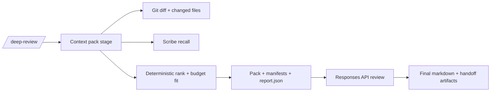

# Deep Review Extension

Run a 2-phase deep PR review flow inside your current Pi session:

1. Context packing for the current branch/repo
2. Direct OpenAI Responses API streaming (reasoning + final answer)

## Setup

```bash
# 1) OpenAI auth
export OPENAI_API_KEY=your_key_here

# 2) Required for token budgeting in context pack stage
cargo install tokencount

# 3) Install/update package (choose one)

# standalone extension package (npm)
pi install npm:pi-deep-review

# standalone extension package (git)
pi install git:github.com/ferologics/pi-deep-review
```

Then in Pi:

```text
/deep-review "review the code"
```

Typical runtime is ~6–20 minutes depending on repo size, Scribe graph expansion, and model latency.

## Recommended extras

- `gh` (GitHub CLI): auto-includes PR title/body in context metadata when available.
- `npx @sibyllinesoft/scribe@1.0.4` (or global `@sibyllinesoft/scribe`): related/dependent code expansion.
  - Note: Cargo `scribe-cli` is a different CLI flavor and is not supported by this extension.

## Commands

- `/deep-review <query> [options]`
- `/deep-review-stop`

## Defaults

- Model: `gpt-5.2`
- Reasoning effort: `xhigh`
- Summary: `auto`
- Verbosity: `medium`
- Context-pack budget target: `272000`
- Base ref: auto-detected (`origin/main`, `origin/master`, `main`, `master`, `HEAD~1`)

## Options

- `--query <text>` (alternative to positional query; cannot be combined with positional query text)
- `--project <path>`
- `--base <ref>`
- `--context-pack <path>` (skip generation and use existing context pack)
- `--budget <tokens>` (context-pack budget target; cannot combine with `--context-pack`)
- `--model <id>`
- `--effort minimal|low|medium|high|xhigh`
- `--verbosity low|medium|high`
- `--summary auto|detailed|null`
- `--no-summary` (shortcut for `--summary null`)
- `--org <id>`
- `--project-id <id>`
- `--debug`
- `--help`

## Example

```text
/deep-review "find bugs and regressions"
```

## Architecture (high level)



Detailed maintainer architecture and decision log:
`extensions/deep-review/ARCH.md`

## Context-pack artifacts

Generated pack output includes:

- `pr-context.txt`
- `pr-context.changed.files.txt`
- `pr-context.related.files.txt`
- `pr-context.omitted.files.txt`
- `pr-context.related.omitted.files.txt`
- `pr-context.related.selection.tsv`
- `pr-context.scribe.targets.tsv`
- `pr-context.report.json`

## Notes

- If `--context-pack <path>` is provided, generation is skipped.
- Context packing is deterministic and executed directly in the extension (no nested `pi -p` skill hop).
- Related-file omissions are explicitly reported with reasons.
- Context-pack generation applies request headroom reserve internally (query + protocol overhead), so effective pack budget can be lower than the configured target.
- Related candidates that are already in changed files are de-duplicated from related omission stats/manifests.
- Related test/test-data files are only eligible when close to changed modules (shared path affinity or short graph distance).
- `--debug` writes context-pack + responses debug artifacts to a temp directory.
- Maintainer internals and decision log: `extensions/deep-review/ARCH.md`.
- Streamed reasoning/answer text is not shown live in widget text; full markdown is posted at completion.
- Final answer/thinking/report files are written to a temp handoff directory and linked in output.
- The extension attempts to copy the final answer to clipboard automatically.
