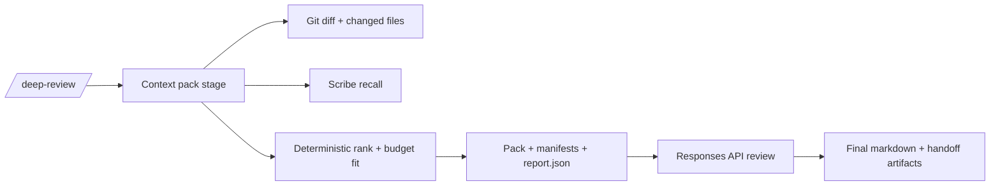

# Deep Review Extension

Run a 2-phase deep PR review flow inside your current Pi session:

1. Context packing for the current branch/repo
2. Direct Responses API streaming through OpenAI Codex or OpenAI Platform (reasoning + final answer)

## Setup

```bash
# 1) OpenAI Codex auth (default; ChatGPT Plus/Pro)
# Run inside Pi:
# /login openai-codex

# Optional: OpenAI Platform auth for --provider openai
export OPENAI_API_KEY=your_key_here

# 2) Required for token budgeting in context pack stage
cargo install tokencount

# 3) Install/update package (choose one)

# standalone extension package (npm)
pi install npm:pi-deep-review

# standalone extension package (git)
pi install git:github.com/ferologics/pi-deep-review
```

Then in Pi:

```text
/deep-review "review the code"
```

Typical runtime is ~6–20 minutes depending on repo size, Scribe graph expansion, and model latency.

## Recommended extras

- `gh` (GitHub CLI): auto-includes PR title/body in context metadata when available.
- `npx @sibyllinesoft/scribe@1.0.4` (or global `@sibyllinesoft/scribe`): related/dependent code expansion.
  - Note: Cargo `scribe-cli` is a different CLI flavor and is not supported by this extension.

## Commands

- `/deep-review <query> [options]`
- `/deep-review-stop`

## Defaults

- Provider: `openai-codex` (ChatGPT subscription)
- Model: `gpt-5.6-sol`
- Reasoning effort: `max` on GPT-5.6, otherwise `xhigh`
- Reasoning mode: omitted on the Codex subscription route; `pro` by default on direct OpenAI GPT-5.6
- Summary: `auto`
- Verbosity: `high` on pro models, otherwise `medium`
- Context-pack budget target: auto-sized from the selected provider/model
- Base ref: auto-detected (`origin/main`, `origin/master`, `main`, `master`, `HEAD~1`)

## Options

- `--query <text>` (alternative to positional query; cannot be combined with positional query text)
- `--project <path>`
- `--base <ref>`
- `--context-pack <path>` (skip generation and use existing context pack)
- `--budget <tokens>` (override the auto-sized context-pack budget target; cannot combine with `--context-pack`)
- `--provider openai-codex|openai`
- `--model <id>` (common ids: `gpt-5.6-sol`, `gpt-5.6-terra`, `gpt-5.6-luna`, `gpt-5.5`, `gpt-5.5-pro`)
- `--effort minimal|low|medium|high|xhigh|max`
- `--mode standard|pro` (direct OpenAI GPT-5.6 only)
- `--verbosity low|medium|high` (default: `high` in pro mode/on pro models, otherwise `medium`)
- `--summary auto|detailed|null`
- `--no-summary` (shortcut for `--summary null`)
- `--org <id>` (OpenAI Platform only)
- `--project-id <id>` (OpenAI Platform only)
- `--debug`
- `--help`

## User context-pack config

Deep Review reads an optional user config from `~/.pi/deep-review.json`. Use it for local, machine-specific context-pack excludes that should not be committed to the reviewed repo.

```json
{
    "contextPack": {
        "repos": {
            "/absolute/path/to/repo": {
                "exclude": [
                    "rust/simulator/**",
                    "web/sdk/src/generated/**"
                ]
            }
        }
    }
}
```

Exclude patterns are repo-root-relative globs. Matching changed files are removed from the changed-file list, git diff, full-file blocks, Scribe targets, and related-file candidates. They are still recorded in manifests and reports as `filtered:config-exclude`.

## Example

```text
/deep-review "find bugs and regressions"
/deep-review "find bugs and regressions" --model gpt-5.6-terra
/deep-review "find bugs and regressions" --provider openai
```

Model availability depends on the OpenAI account / token backing the request. By default, `/deep-review` uses GPT-5.6 Sol through the ChatGPT Codex backend (`openai-codex`) and OAuth from `/login openai-codex`. Pass `--provider openai` to use GPT-5.6 Sol in pro mode through OpenAI Platform credentials from `OPENAI_API_KEY`; this route explicitly budgets against the official 1.05M context window.

## Architecture (high level)


```mermaid
flowchart LR
    A[/deep-review/] --> B[Context pack stage]
    B --> C[Git diff + changed files]
    B --> D[Scribe recall]
    B --> E[Deterministic rank + budget fit]
    E --> F[Pack + manifests + report.json]
    F --> G[Responses API review]
    G --> H[Final markdown + handoff artifacts]
```

Detailed maintainer architecture and decision log:
`extensions/deep-review/ARCH.md`

## Context-pack artifacts

Generated pack output includes:

- `pr-context.txt`
- `pr-context.changed.files.txt`
- `pr-context.related.files.txt`
- `pr-context.omitted.files.txt`
- `pr-context.related.omitted.files.txt`
- `pr-context.related.selection.tsv`
- `pr-context.scribe.targets.tsv`
- `pr-context.report.json`

## Notes

- If `--context-pack <path>` is provided, generation is skipped.
- If `~/.pi/deep-review.json` contains excludes for the current repo, context packing applies them before diff and full-file rendering.
- Context packing is deterministic and executed directly in the extension (no nested `pi -p` skill hop).
- Related-file omissions are explicitly reported with reasons.
- By default, context-pack budget is derived from the selected provider/model metadata as the lower of:
  - `contextWindow - maxTokens`
  - `75% of contextWindow`
- Deep-review keeps the Codex subscription route's registered GPT-5.6 context window (`372000` tokens).
- Direct OpenAI GPT-5.6 models explicitly use their official `1050000` token context window before budgeting. Inputs above `272000` tokens use OpenAI's higher long-context pricing tier.
- Deep-review also corrects stale `gpt-5.4` OpenAI/OpenAI Codex registry metadata to a `1.05M`-class context window before budgeting.
- This preserves the old ~`272000` input-target behavior on `400k/128k` class models while scaling up only on routes with known large-window support.
- If model metadata is unavailable, deep-review falls back to a `272000` token pre-reserve target.
- Manual `--budget` values are still capped by the selected model's hard input limit (`contextWindow - maxTokens`) when model metadata is available.
- Context-pack generation then subtracts request headroom (query + protocol overhead), so effective pack budget can be lower than the configured or auto-derived target.
- Related candidates that are already in changed files are de-duplicated from related omission stats/manifests.
- Related test/test-data files are only eligible when close to changed modules (shared path affinity or short graph distance).
- `--debug` writes context-pack + responses debug artifacts to a temp directory.
- Maintainer internals and decision log: `extensions/deep-review/ARCH.md`.
- Streamed reasoning/answer text is not shown live in widget text; full markdown is posted at completion.
- Final answer/thinking/report files are written to a temp handoff directory and linked in output.
- The extension attempts to copy the final answer to clipboard automatically.
